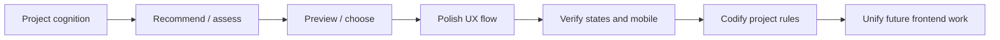

# ui-ux Codex Skill

[](https://github.com/atuizz/codex-ui-ux-skill/actions/workflows/validate.yml)
[](https://github.com/atuizz/codex-ui-ux-skill/releases)
[](LICENSE)
[](ui-ux/SKILL.md)
[](#)

**Language:** English | [简体中文](README.zh-CN.md)

> A UI/UX quality gate for Codex: help agents build product-aware frontend
> interfaces instead of generic AI dashboards, card walls, and README-on-screen
> pages.

`ui-ux` is an unofficial community-maintained Codex skill for frontend UI/UX
quality work. It makes the agent establish project cognition, user journeys,
business-object boundaries, recovery states, mobile priorities, and frontend
governance before changing product UI.

The installable skill bundle lives in [`ui-ux/`](ui-ux/). Root-level files are
for open-source maintenance and release workflows.

---

## Why this exists

AI-generated frontend often looks clean in a screenshot but fails the product
task:

| Common failure | What this skill pushes the agent to do instead |
|---|---|
| Generic SaaS dashboard | Understand the actual user, object model, task, and journey |
| Card wall with no priority | Make the first decision and primary action obvious |
| Landing-page styling on tools | Match the surface type: workbench, admin, console, wizard, detail, etc. |
| Raw technical states in UI | Translate states into human-facing copy with next steps |
| Mobile as desktop stacking | Reorder mobile around the primary task |
| One-off polish | Codify reusable frontend governance for future agents |

The goal is:

```text
raw GPT output → stable component baseline → project-specific product UI → polished, unified frontend
```

---

## What this skill is for

Use this skill when frontend work materially affects a web product surface:

- page creation, redesign, polish, rescue, or review;
- screenshot or UX critique;
- component-system or UI-foundation choices;
- shadcn/Tailwind/table/form patterns with user-visible impact;
- loading, empty, error, permission, success, long-text, mobile, or accessibility states;
- frontend governance docs such as `DESIGN.md`, `FRONTEND_CONTRACT.md`,
  `PAGE_BRIEF.md`, and `FRONTEND_REVIEW.md`.

Skip it for pure backend/API/data/model work, dependency chores, mechanical
renames, or tests with no user-visible frontend impact.

---

## How it works



The skill asks the agent to reason about:

- project in human words;
- core users and business objects;
- page/surface type;
- primary task and first decision;
- entry point, success criterion, and recovery path;
- product temperament and user-facing vocabulary;
- loading, empty, error, permission, success, long-text, mobile, and accessibility states.

---

## What is included

| Path | Purpose |
|---|---|
| [`ui-ux/SKILL.md`](ui-ux/SKILL.md) | Main Codex skill instructions |
| [`ui-ux/references/`](ui-ux/references/) | Progressive-disclosure guidance for workflow, UX evaluation, anti-patterns, tool selection, and guardrails |
| [`ui-ux/templates/`](ui-ux/templates/) | Project governance templates copied into target repos |
| [`ui-ux/scripts/init_frontend_quality.py`](ui-ux/scripts/init_frontend_quality.py) | Scaffold frontend governance docs into another project |
| [`ui-ux/evals/evals.json`](ui-ux/evals/evals.json) | Functional eval cases |
| [`ui-ux/evals/trigger-evals.json`](ui-ux/evals/trigger-evals.json) | Trigger / skip boundary evals |
| [`quick_validate.py`](quick_validate.py) | Dependency-free structural validator and smoke test |
| [`scripts/package_skill.py`](scripts/package_skill.py) | Release packager for `.skill` archives |

---

## Install locally

### Option A — download a release artifact

Download the latest `.skill` archive from:

[https://github.com/atuizz/codex-ui-ux-skill/releases](https://github.com/atuizz/codex-ui-ux-skill/releases)

### Option B — copy from a checkout

Validate first:

```powershell
cd D:\UI-UX
python -S quick_validate.py
```

Then copy only the installable skill bundle:

```powershell
Copy-Item -Recurse -Force "D:\UI-UX\ui-ux" "C:\Users\Administrator\.codex\skills\ui-ux"
```

On macOS/Linux-style environments, adapt the destination to your `CODEX_HOME`:

```bash
cp -R ./ui-ux "$CODEX_HOME/skills/ui-ux"
```

> Do not copy the repository root into your skills directory. Only copy
> `ui-ux/`.

---

## Quick usage examples

Ask Codex things like:

```text
This React admin page looks like a generic AI dashboard. Review the UX flow,
business-object boundaries, empty/error states, and mobile behavior before
changing code.
```

```text
Install frontend governance docs in this repository. Add DESIGN.md,
FRONTEND_CONTRACT.md, PAGE_BRIEF.md, and FRONTEND_REVIEW.md, with only a short
AGENTS.md pointer.
```

```text
Only change the failed payment state copy. Translate the technical status into
human-facing text with a next step. Do not refactor the page.
```

---

## Validate before every change

```powershell
python -S quick_validate.py
```

The validator checks:

- skill metadata and progressive-disclosure structure;
- required references, templates, scripts, and evals;
- smoke behavior of `scripts/init_frontend_quality.py`;
- release packaging behavior;
- absence of cache/build artifacts in the skill bundle;
- open-source project hygiene files and CI workflow.

`python -S` is intentional: it avoids user-site Python startup issues and keeps
validation focused on repository files.

---

## Evaluation assets

- [`ui-ux/evals/evals.json`](ui-ux/evals/evals.json) covers functional behavior.
- [`ui-ux/evals/trigger-evals.json`](ui-ux/evals/trigger-evals.json) covers trigger
  and skip boundaries.
- [`docs/BENCHMARK_TEMPLATE.md`](docs/BENCHMARK_TEMPLATE.md) provides a release
  benchmark report template.

See [`docs/EVALUATION.md`](docs/EVALUATION.md) for the evaluation workflow.

---

## Package a release artifact

Validate first, then create a `.skill` archive:

```powershell
python -S quick_validate.py
python -S scripts/package_skill.py
```

The archive is written to:

```text
dist/ui-ux-<version>.skill
```

It intentionally includes only the installable `ui-ux/` skill bundle.

---

## Project status

Current release: [`v0.1.4`](https://github.com/atuizz/codex-ui-ux-skill/releases/tag/v0.1.4)

Maturity:

- ✅ installable skill bundle;
- ✅ validation script;
- ✅ GitHub Actions CI;
- ✅ functional evals and trigger-boundary evals;
- ✅ release packaging;
- ⏳ full with-skill vs baseline benchmark report.

See [`docs/OPEN_SOURCE_MATURITY.md`](docs/OPEN_SOURCE_MATURITY.md) and
[`docs/ROADMAP.md`](docs/ROADMAP.md).

---

## Contributing

Please read [`CONTRIBUTING.md`](CONTRIBUTING.md). In short:

1. Keep `ui-ux/SKILL.md` concise.
2. Add or update evals when changing behavior.
3. Run `python -S quick_validate.py`.
4. Do not put README/changelog/general project docs inside the skill bundle.

---

## Security

Do not add secrets, private URLs, tokens, customer data, or organization-specific
identifiers to templates, references, evals, or examples.

See [`SECURITY.md`](SECURITY.md).

---

## License

MIT. See [`LICENSE`](LICENSE).

