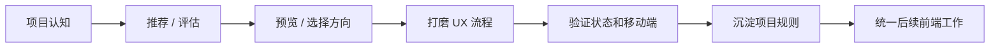

# ui-ux Codex Skill

[](https://github.com/atuizz/codex-ui-ux-skill/actions/workflows/validate.yml)
[](https://github.com/atuizz/codex-ui-ux-skill/releases)
[](LICENSE)
[](ui-ux/SKILL.md)
[](#)

**语言：** [English](README.md) | 简体中文

> 一个给 Codex 用的 UI/UX 质量门禁：让 Agent 在改前端之前先理解产品、
> 用户任务、业务对象、状态恢复和移动端优先级，而不是继续产出通用 AI 仪表盘、
> 卡片墙和 README 式页面。

`ui-ux` 是一个非官方、社区维护的 Codex skill，用于前端 UI/UX 质量工作。
它会要求 Agent 在修改产品界面前先建立项目认知、用户旅程、业务对象边界、
恢复路径、移动端任务优先级和前端治理规范。

可安装的 skill 本体在 [`ui-ux/`](ui-ux/) 目录中。仓库根目录的文件用于开源项目维护和发布流程。

---

## 为什么需要它

AI 生成的前端经常“截图看起来还行”，但真实产品任务失败：

| 常见问题 | 这个 skill 会推动 Agent 改成什么 |
|---|---|
| 通用 SaaS 仪表盘 | 先理解真实用户、业务对象、任务和旅程 |
| 一堆等权重卡片 | 明确第一个决策和主操作 |
| 工具页被做成 landing page | 按页面类型设计：工作台、后台、控制台、向导、详情页等 |
| UI 直接展示技术状态 | 翻译成人能理解的文案，并给出下一步 |
| 移动端只是机械堆叠 | 按移动端主任务重新排序 |
| 一次性美化 | 把可复用规则沉淀为前端治理文档 |

目标是：

```text
原始 GPT 输出 → 稳定组件基线 → 项目专属产品 UI → 统一、可维护的前端体验
```

---

## 适用场景

当前端工作会实质影响 Web 产品界面时，使用这个 skill：

- 新页面、重设计、视觉打磨、救援式重构或 UX review；
- 截图评审或 UX 诊断；
- 组件系统、UI foundation、设计系统选择；
- shadcn / Tailwind / 表格 / 表单等用户可见模式；
- loading、empty、error、permission、success、长文本、移动端、无障碍状态；
- 创建或维护 `DESIGN.md`、`FRONTEND_CONTRACT.md`、`PAGE_BRIEF.md`、
  `FRONTEND_REVIEW.md` 等前端治理文档。

不适合用于纯后端/API/数据/模型改动、依赖升级、机械重命名，或没有任何用户可见前端影响的测试。

---

## 工作方式



它会要求 Agent 先回答：

- 这个项目用人话怎么说；
- 核心用户是谁；
- 核心业务对象是什么；
- 当前页面/界面类型是什么；
- 用户主任务和第一个决策是什么；
- 用户从哪里进入，什么算成功，失败后如何恢复；
- 产品气质和用户可见词汇是什么；
- loading、empty、error、permission、success、长文本、移动端、无障碍状态如何处理。

---

## 仓库包含什么

| 路径 | 用途 |
|---|---|
| [`ui-ux/SKILL.md`](ui-ux/SKILL.md) | skill 主指令 |
| [`ui-ux/references/`](ui-ux/references/) | 工作流、UX 评估、反模式、工具选择、开发红线等渐进式参考文档 |
| [`ui-ux/templates/`](ui-ux/templates/) | 可复制到目标项目的前端治理模板 |
| [`ui-ux/scripts/init_frontend_quality.py`](ui-ux/scripts/init_frontend_quality.py) | 在其他项目中初始化前端治理文档 |
| [`ui-ux/evals/evals.json`](ui-ux/evals/evals.json) | 功能行为 eval |
| [`ui-ux/evals/trigger-evals.json`](ui-ux/evals/trigger-evals.json) | 触发 / 跳过边界 eval |
| [`quick_validate.py`](quick_validate.py) | 无第三方依赖的结构校验和烟测 |
| [`scripts/package_skill.py`](scripts/package_skill.py) | `.skill` 发布包生成脚本 |

---

## 本地安装

### 方式 A：下载 release 包

从这里下载最新 `.skill` 文件：

[https://github.com/atuizz/codex-ui-ux-skill/releases](https://github.com/atuizz/codex-ui-ux-skill/releases)

### 方式 B：从源码复制

先校验：

```powershell
cd D:\UI-UX
python -S quick_validate.py
```

然后只复制可安装的 skill 本体：

```powershell
Copy-Item -Recurse -Force "D:\UI-UX\ui-ux" "C:\Users\Administrator\.codex\skills\ui-ux"
```

macOS / Linux 风格环境可以改成：

```bash
cp -R ./ui-ux "$CODEX_HOME/skills/ui-ux"
```

> 不要把仓库根目录整个复制进 skills 目录。只复制 `ui-ux/`。

---

## 使用示例

可以这样问 Codex：

```text
这个 React 后台页面看起来像通用 AI 仪表盘。先评审 UX flow、业务对象边界、
empty/error 状态和移动端行为，再决定怎么改代码。
```

```text
给当前仓库安装前端治理文档。添加 DESIGN.md、FRONTEND_CONTRACT.md、
PAGE_BRIEF.md、FRONTEND_REVIEW.md，并且 AGENTS.md 里只放短指针。
```

```text
只改失败支付状态的文案。把技术状态翻译成人能懂的话，并补一个下一步提示。
不要重构页面。
```

---

## 每次修改前都要校验

```powershell
python -S quick_validate.py
```

校验内容包括：

- skill 元数据和渐进披露结构；
- 必需的 references、templates、scripts、evals；
- `scripts/init_frontend_quality.py` 的烟测；
- release 打包行为；
- skill 本体中没有缓存/构建产物；
- 开源项目治理文件和 CI workflow。

这里建议使用 `python -S`，是为了避开用户本机 Python site 包启动问题，让校验只关注仓库本身。

---

## Evaluation assets

- [`ui-ux/evals/evals.json`](ui-ux/evals/evals.json)：功能行为 eval。
- [`ui-ux/evals/trigger-evals.json`](ui-ux/evals/trigger-evals.json)：触发 / 跳过边界 eval。
- [`docs/BENCHMARK_TEMPLATE.md`](docs/BENCHMARK_TEMPLATE.md)：release benchmark 报告模板。

评估流程见 [`docs/EVALUATION.md`](docs/EVALUATION.md)。

---

## 打包 release artifact

先校验，再生成 `.skill` 包：

```powershell
python -S quick_validate.py
python -S scripts/package_skill.py
```

输出位置：

```text
dist/ui-ux-<version>.skill
```

包里只包含可安装的 `ui-ux/` skill 本体。

---

## 项目状态

当前版本：[`v0.1.1`](https://github.com/atuizz/codex-ui-ux-skill/releases/tag/v0.1.1)

成熟度：

- ✅ 可安装 skill 本体；
- ✅ validation script；
- ✅ GitHub Actions CI；
- ✅ 功能 eval 和触发边界 eval；
- ✅ release 打包；
- ⏳ 完整 with-skill vs baseline benchmark 报告。

更多见 [`docs/OPEN_SOURCE_MATURITY.md`](docs/OPEN_SOURCE_MATURITY.md) 和
[`docs/ROADMAP.md`](docs/ROADMAP.md)。

---

## 贡献

请先阅读 [`CONTRIBUTING.md`](CONTRIBUTING.md)。简要规则：

1. 保持 `ui-ux/SKILL.md` 精简。
2. 行为变化要更新 eval。
3. 运行 `python -S quick_validate.py`。
4. 不要把 README、changelog、通用项目文档放进 skill 本体目录。

---

## 安全

不要把 secrets、私有 URL、token、客户数据或组织内部标识写入模板、参考文档、eval 或示例。

见 [`SECURITY.md`](SECURITY.md)。

---

## License

MIT。见 [`LICENSE`](LICENSE)。

